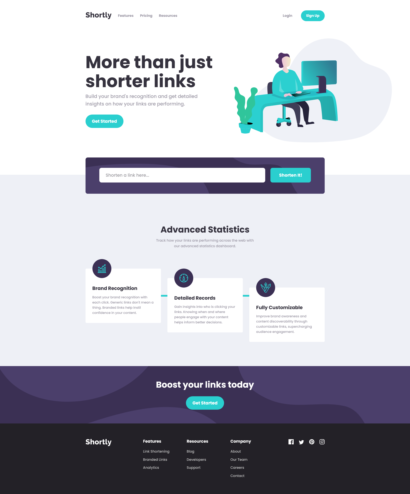
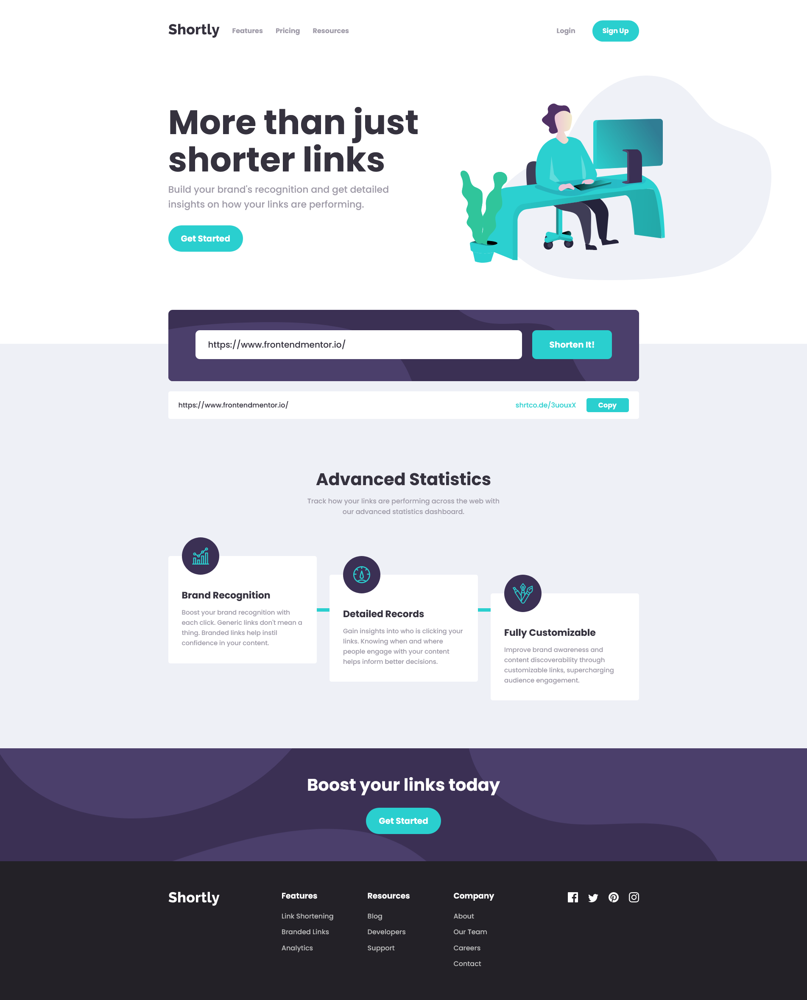
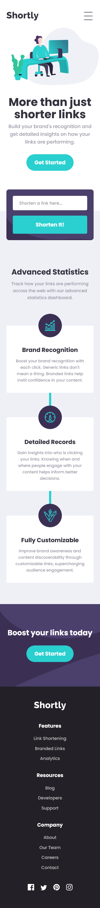
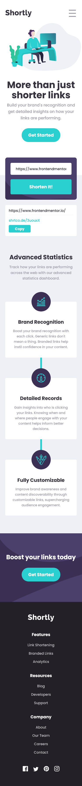

# Frontend Mentor - Shortly URL shortening API Challenge solution

This is a solution to the [Shortly URL shortening API Challenge challenge on Frontend Mentor](https://www.frontendmentor.io/challenges/url-shortening-api-landing-page-2ce3ob-G). Frontend Mentor challenges help you improve your coding skills by building realistic projects.

### Screenshots

### Links

- Solution URL: [Frontend Mentor Solution Page](https://your-solution-url.com)
- Live Site URL: [GitHub Pages Site](https://your-live-site-url.com)

### Useful resources

- [MDN docs](https://developer.mozilla.org/en-US/docs/Mozilla/Add-ons/WebExtensions/Interact_with_the_clipboard) - Interacting with clipboard
- [Shortening API docs](https://shrtco.de/docs/)

## Author

- Frontend Mentor - [@yourusername](https://www.frontendmentor.io/profile/yourusername)
